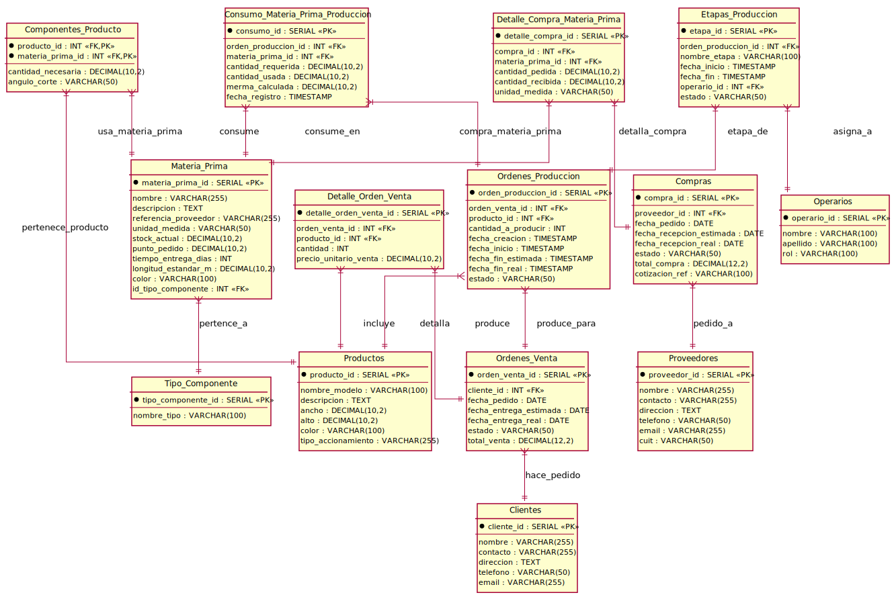

# Sistema de Gestión Industrial

Sistema integral para la gestión de producción de aberturas de aluminio, con módulos de inventario, órdenes de producción, ventas, compras y analítica avanzada.

## 🚀 Características Principales

### ✅ Completado (Fase 1 y Fase 2)

- **Autenticación y Seguridad**
  - JWT con cookies (7 días de expiración)
  - RBAC (admin, gerente, operario)
  - Middleware Edge Runtime compatible
  - Refresh tokens automáticos

- **Validación de Datos**
  - Zod schemas (32 esquemas completos)
  - Sanitización automática
  - Validación de relaciones (14 funciones)
  - Prevención SQL injection

- **Manejo de Errores**
  - 8 clases especializadas de error
  - 40+ códigos estandarizados
  - Winston logging estructurado
  - Sentry integration (producción)

- **Testing Automatizado**
  - 112 tests (Jest + Testing Library)
  - CI/CD con GitHub Actions
  - Coverage reports automáticos
  - Matrix testing (Node 18.x, 20.x)

- **Dashboard Ejecutivo**
  - 4 KPIs en tiempo real
  - Gráficos interactivos (Recharts)
  - Comparativas mes a mes
  - Auto-refresh cada 5 minutos

- **Reportes Exportables**
  - Generación PDF (jsPDF)
  - Exportación Excel (ExcelJS)
  - Envío por email (Nodemailer)
  - 4 tipos de reportes

- **Análisis de Eficiencia** ✨ NUEVO
  - 4 KPIs de producción
  - Detección de cuellos de botella
  - 8 categorías de recomendaciones automáticas
  - Sistema de priorización inteligente

## 🏗️ Arquitectura Técnica

### Stack Tecnológico

```
Frontend:  Next.js 14 (App Router) + TypeScript + TailwindCSS + shadcn/ui
Backend:   Next.js API Routes + PostgreSQL 15
Auth:      JWT + bcryptjs + Cookie-based (hybrid)
Testing:   Jest + Testing Library + GitHub Actions
Logs:      Winston (files) + Sentry (production)
Charts:    Recharts v2
Reports:   jsPDF + ExcelJS + Nodemailer
```

### Base de Datos

PostgreSQL con esquema optimizado para manufactura:

## 📊 Diagrama de Entidades

Este diseño se ha elaborado siguiendo principios de normalización para asegurar la integridad de los datos y minimizar la redundancia, adaptándose a las necesidades específicas de la gestión de una planta de aberturas.

### Entidades Principales:

- Venta: Mapeado a la tabla Ordenes_Venta.
- Orden de Produccion: Mapeado a la tabla Ordenes_Produccion.
- Materia Prima: Mapeado a la tabla Materia_Prima.
- Producto: Mapeado a la tabla Productos (representa la abertura terminada).
- Compra: Mapeado a la tabla Compras.
- Inventario: Integrado en la tabla Materia_Prima (campo stock_actual) y actualizado por las tablas Detalle_Compra_Materia_Prima y Consumo_Materia_Prima_Produccion.
- Proveedor: Mapeado a la tabla Proveedores.
- Cliente: Mapeado a la tabla Clientes.
- Operario: Mapeado a la tabla Operarios.



---

## 🎯 Estado del Proyecto

### Fase 1: Fundamentos ✅ COMPLETADA (Enero 2025)

- ✅ Autenticación JWT + RBAC
- ✅ Validación Zod (32 schemas)
- ✅ Error Handling (8 clases)
- ✅ Testing (112 tests)
- **Duración**: 2 meses
- **LOC**: ~6,600 + 5,500 docs

### Fase 2: Analítica y Reportes ✅ COMPLETADA (Noviembre 2025)

#### 2.1 Dashboard Ejecutivo ✅

- 4 KPIs en tiempo real
- Auto-refresh cada 5 minutos
- Gráfico producción diaria
- **LOC**: 725

#### 2.2 Reportes Exportables ✅

- PDF profesionales (jsPDF)
- Excel con fórmulas (ExcelJS)
- Email automático (Nodemailer)
- 4 tipos de reportes
- **LOC**: 2,900+

#### 2.3 Análisis de Eficiencia ✅ **RECIÉN COMPLETADO**

- 4 KPIs de producción con estados de salud
- Detección automática de cuellos de botella
- 8 categorías de recomendaciones
- Sistema de priorización inteligente
- **LOC**: 1,803
- **Completado**: 13 noviembre 2025

**Total Fase 2**: ~5,428 líneas de código

---

## 📚 Documentación

- **[ROADMAP_DESARROLLO.md](./ROADMAP_DESARROLLO.md)**: Plan completo de desarrollo
- **[AUTH_README.md](./AUTH_README.md)**: Sistema de autenticación
- **[GUIA_USUARIO.md](./GUIA_USUARIO.md)**: Manual de usuario final
- **[INSTALACION_DEPLOYMENT.md](./INSTALACION_DEPLOYMENT.md)**: Setup y deployment
- **[EFFICIENCY_ANALYSIS_GUIDE.md](./EFFICIENCY_ANALYSIS_GUIDE.md)**: Análisis de eficiencia
- **[DASHBOARD_GUIDE.md](./DASHBOARD_GUIDE.md)**: Dashboard ejecutivo
- **[VALIDATION_GUIDE.md](./VALIDATION_GUIDE.md)**: Validación de datos
- **[ERROR_HANDLING_GUIDE.md](./ERROR_HANDLING_GUIDE.md)**: Manejo de errores
- **[TESTING_GUIDE.md](./TESTING_GUIDE.md)**: Testing automatizado

---

## 🚀 Quick Start

```bash
# 1. Clonar
git clone https://github.com/tuempresa/industrial.git
cd industrial

# 2. Instalar
npm install

# 3. Configurar .env.local
cp .env.example .env.local
# Editar con tus credenciales de BD y JWT secrets

# 4. Base de datos
psql -U postgres -f scripts/database-schema.sql

# 5. Iniciar
npm run dev

# 6. Abrir navegador
http://localhost:3000

# 7. Login
admin@ejemplo.com / admin123
```

---

## 🔐 Autenticación

### Credenciales de Demo

```
Admin:    admin@ejemplo.com    / admin123
Gerente:  gerente@ejemplo.com  / gerente123
Operario: operario@ejemplo.com / operario123
```

### Flujo de Autenticación

1. **Login**: POST /api/auth/login → Cookie + localStorage
2. **Middleware**: Edge Runtime (presencia de token)
3. **API Routes**: Node.js Runtime (validación JWT completa)
4. **Duración**: 7 días (renovación automática)

---

## 📊 Métricas del Proyecto

### Código

```
Líneas totales:        ~12,000
Archivos creados:      ~150+
Componentes React:     ~80
API Endpoints:         ~30
Tests:                 112 (100% passing)
Vulnerabilidades:      0
```

### Tecnologías

```
Next.js:       14.2.33
TypeScript:    5.x
PostgreSQL:    15
React:         18
TailwindCSS:   3.x
Jest:          29.x
```

---

## 🎯 Próximas Fases

### Fase 3: Optimización y IA (Q1-Q2 2026)

- Predicción de demanda (ML)
- Optimización de inventario (EOQ)
- Detección de anomalías
- Planificación automática

Ver [ROADMAP_DESARROLLO.md](./ROADMAP_DESARROLLO.md) para detalles completos.

---

## 📝 Notas de la Implementación Reciente

### Cambios en Autenticación (13 Nov 2025)

**Problema**: Middleware con JWT no funcionaba en Edge Runtime

**Solución implementada**:

- Middleware solo verifica PRESENCIA de token (Edge compatible)
- API routes validan JWT completo (Node.js Runtime)
- Sistema híbrido: Cookie + localStorage
- Full page reload en login para asegurar cookies

**Archivos modificados**:

- `middleware.ts`: Removida validación JWT, solo check de presencia
- `app/login/page.tsx`: Agregado `window.location.href` + delay de 100ms
- `app/api/auth/login/route.ts`: Cookie set con SameSite=Lax

### Análisis de Eficiencia (13 Nov 2025)

**Implementado**:

- Sistema completo de KPIs con 4 métricas principales
- Detección inteligente de 3 tipos de cuellos de botella
- Motor de recomendaciones con 8 categorías de análisis
- UI responsive con cards, progress bars y badges

**Archivos creados**:

- `lib/analytics/efficiency-analyzer.ts` (420 líneas)
- `lib/analytics/bottleneck-detector.ts` (360 líneas)
- `lib/analytics/recommendation-engine.ts` (450 líneas)
- `app/api/analytics/efficiency/route.ts` (130 líneas)
- `app/dashboard/analisis-eficiencia/page.tsx` (443 líneas)

---

## 🤝 Contribución

Ver [CONTRIBUTING.md](./CONTRIBUTING.md) para guías de contribución.

---

## 📄 Licencia

Propietario - Todos los derechos reservados

---

## ✨ Database Schema

### Gestión de la Materia Prima y Medidas:

- Materia_Prima: Esta tabla es el corazón del sistema para la gestión de inventario. Incluye atributos como referencia_proveedor (ej. 1897221842.001), unidad_medida, costo_unitario, longitud_estandar_m (ej. 5.8 m o 6m), y color.
- Productos: Contiene los detalles de las aberturas terminadas, como ancho, alto, nombre_modelo (V1, V2, V3) y tipo_accionamiento. Esto permite definir un producto específico por sus dimensiones y características.
- Componentes_Producto (BOM - Lista de Materiales): Es fundamental. Aquí se desglosa cada Producto en sus Materia_Prima necesarias y las cantidad_necesaria para producir una unidad del producto. La información de ToT L.Corte y Ángulo de las fuentes se traduce en la cantidad_necesaria y angulo_corte para cada material por producto.
- Administración de Órdenes a Proveedores:
  - Las tablas Proveedores, Compras, y Detalle_Compra_Materia_Prima están diseñadas para registrar todo el ciclo de adquisición. Se capturan detalles como cotizacion_ref, Art.-Nr. (mapeado a referencia_proveedor en Materia_Prima), Precio unitario, Cant. pedida y Unidad de medida directamente de las estructuras de los documentos de pedido.
- Optimización y Control:
  - Optimizar Punto de Pedido (punto_pedido): El campo punto_pedido en Materia_Prima y tiempo_entrega_dias son cruciales. Un sistema externo (o una vista/función en la DB) podría usar el historial de Consumo_Materia_Prima_Produccion y las tendencias de Ordenes_Venta (para la estacionalidad) para recalcular dinámicamente este punto, asegurando que se ordene a tiempo para evitar quiebres de stock.
  - Estacionalidad de Ventas (fecha_pedido): La columna fecha_pedido en Ordenes_Venta permite realizar análisis de datos históricos para identificar patrones estacionales en la demanda de productos, lo que a su vez informará la planificación de la producción y la optimización del inventario de materia prima.
  - Tiempos de Producción (fecha_inicio, fecha_fin_real): La tabla Ordenes_Produccion registra los tiempos reales de inicio y fin, permitiendo calcular la duración efectiva de la producción. La tabla opcional Etapas_Produccion permite un seguimiento más granular de los tiempos por fase y por operario, crucial para identificar cuellos de botella y mejorar la eficiencia de los tiempos de produccion.
  - Optimización de Materia Prima en el Armado (cantidad_usada, merma_calculada, longitud_estandar_m):
    - La longitud_estandar_m en Materia_Prima es clave para los algoritmos de corte (nesting) que buscarán minimizar el desperdicio al cortar piezas de perfiles.
    - La tabla Consumo_Materia_Prima_Produccion es vital. Al registrar la cantidad_usada real frente a la cantidad_requerida teórica, se puede calcular la merma_calculada. Este dato es fundamental para medir la eficacia de las estrategias de optimización de corte y ensamble.
  - Cálculo de Merma (merma_calculada): Este campo, derivado en Consumo_Materia_Prima_Produccion, proporciona una métrica directa de la eficiencia en el uso de los materiales, permitiendo identificar áreas de mejora y cuantificar el impacto de las iniciativas de optimización.
- Orden de Producción Optimizada (Ordenes_Produccion):
  - El diseño proporciona la base de datos con los insumos para un sistema de optimización. La "orden de producción optimizada" sería el resultado de un proceso o algoritmo (externo a la base de datos pero que consume y actualiza sus datos) que toma en cuenta el stock de materia prima, las capacidades de producción, los tiempos de entrega, y la demanda, para generar un plan de producción eficiente. La base de datos registraría este plan optimizado (ej. fechas de inicio y fin calculadas, asignaciones de recursos).


